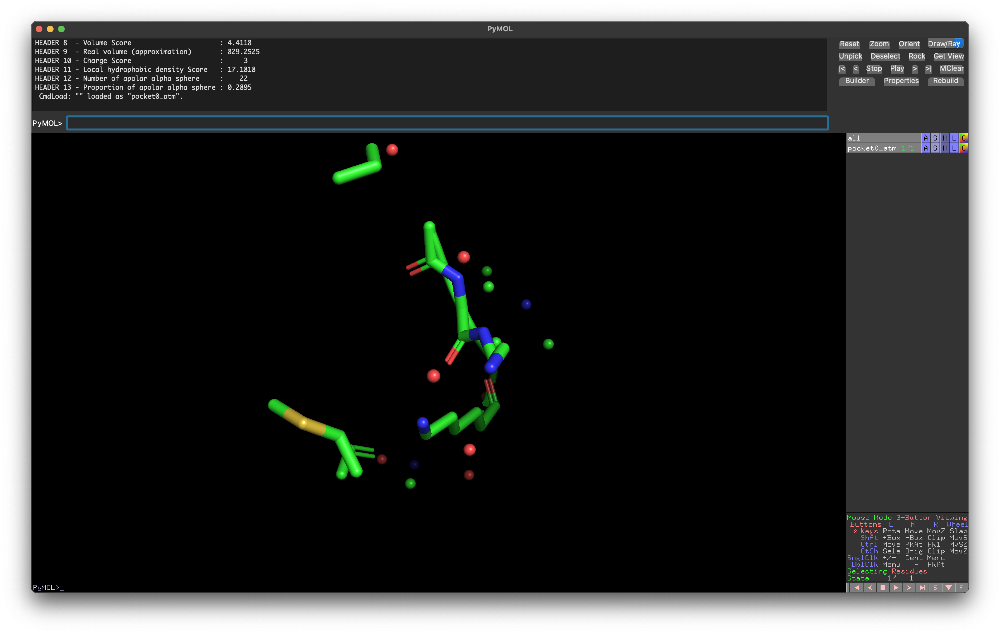
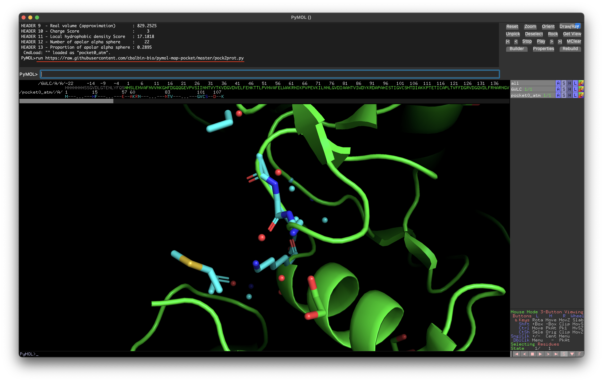
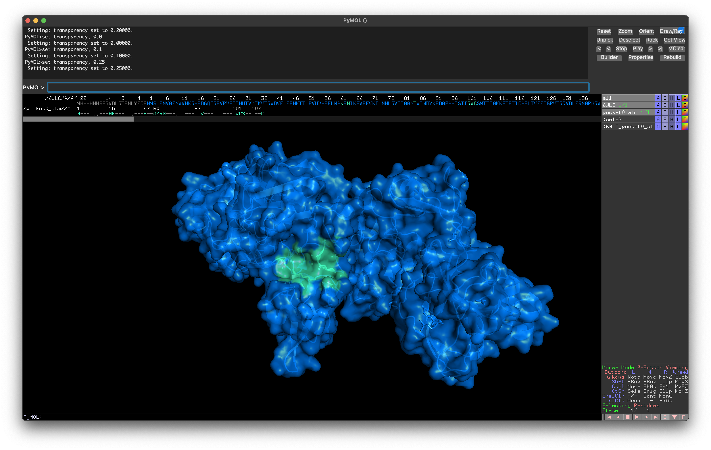

This is a pymol extension to map a protein pocket detected by [PockDrug](http://pockdrug.rpbs.univ-paris-diderot.fr/cgi-bin/index.py?page=home) to the full protein. The pockets returned from PockDrug only contain the atoms that make up the pocket (it does not return it in context of the full protein).

Example of PockDrog Pocket (from 6WLC).


1. Load extension into pymol. In the pymol command prompt:
```
run https://raw.githubusercontent.com/cbalbin-bio/pymol-map-pocket/master/pock2prot.py
```


2. Ensure both the full protein and the pocket are open in your pymol session. Invoke the extension in the pymol command prompt as so:
```
pock2prot pocket_name, protein_name
```


3. A new selection will be created under the name {protein_name}_{pocket_name}. You can now visualize the pocket in context of the full protein. For this example  the full protein was colored blue, the new selection teal, transparency set to 0.25, and full protein shown by surface. 
